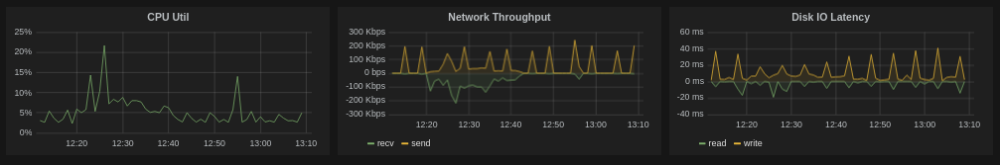

# Gofana


 

Gofana is a self-contained [Grafana](http://grafana.org/) server written in Go with minimal dependencies.  It's designed to make it easy to setup a secure,  grafana-based dashboard system with your existing Graphite or InfluxDB servers.

It handles dashboard storage so that saved dashboards do not need to be saved in Elasticsearch or within InfluxDB making it easier to maintain and back them  up.

It will also proxy Graphite and InfluxDB queries to simplifly serving Grafana over HTTPS as well as removing the need for having Grafana query your metrics store directly.



## Features

* Self-contained grafana 1.9.1 release
* Local file based dashboard store
* HTTP and HTTPS server support
* Basic Authentication Support
* Graphite, InfluxDB and OpenTSDB proxying
* Single Linux/OSX binaries
* _OAuth Authentication (coming soon)_
* _S3 and other Dashboard Storage (coming soon)_

## Getting Started

Gofana requires an existing [Graphite](http://graphite.wikidot.com/), [InfluxDB](http://influxdb.com/)
or [OpenTSDB](http://http://opentsdb.net/) installation.

Gofana handles dashboard storage using the local filesystem (in a `dashboards` directory by default).
When using Graphite or OpenTSDB, you do not need a separate [elasticsearch](http://www.elasticsearch.org/)
server for dashboard storage.  Similarly, when using InfluxDB, dashboards will not be stored in InfluxDB.

### Linux
```
$ curl -sfL https://github.com/jwilder/gofana/releases/download/v0.0.6/gofana-linux-amd64-v0.0.6.tar.gz | tar xvzf - > gofana
$ gofana -graphite-url http://127.0.0.1:8000
```

### OSX
```
$ curl -sfL https://github.com/jwilder/gofana/releases/download/v0.0.6/gofana-darwin-amd64-v0.0.6.tar.gz | tar xvzf - > gofana
$ gofana -graphite-url http://127.0.0.1:8000
```

## Basic Authentication

To password protect your grafana server with HTTP Basic authentication, you can
start gofana with the `-auth user:pw` option.

```
$ gofana -graphite-url http://127.0.0.1:8000 -auth user:pw
```

If you are using Basic authentication, it's a good idea to also use HTTPS.

## HTTPS Server

To run gofana over HTTPS, you need a SSL cert and key.  To create a self-signed key and certificate:

```
$ openssl req -x509 -newkey rsa:2048 -keyout key.pem -out cert.pem -days 3650 -nodes
```

You should have a private `key.pem` and a public `cert.pem` in you current directory.

Then start gofana with `-ssl-cert` and `-ssl-key`.

```
$ gofana -graphite-url http://127.0.0.1:8000 -ssl-cert cert.pem -ssl-key key.pem
```

## Bind Address

By default, gofana will listen on port `8080` for HTTP and `8443` for HTTPS. You can use a different port by passing `-http-addr` and `https-addr` respectively.

## Dashboard Storage

By default, gofana will create a `dashboards` directory in the directory that gofana was started.  You can change this to somewhere else with the `-db-dir`
option.

```
$ gofana -db-dir /mnt/gofana/mydashboards
```

## Updating Grafana

Gofana embeds the latest release of Grafana.  If you want to run an older or customized version of Grafana you can use the `-app-dir` option.  _Note: this is feature is experimental._

```
$ gofana -app-dir /mnt/grafana-1.8.1
```

If you want to bundle a new version of Grafana within gofana, see the [Development](#development) section.


## Why Gofana

The [installation process](http://grafana.org/docs/) for getting a working grafana server is more complicated than expected for a client-side application that runs in the browser.  I needed to expose our internal graphite metrics using Grafana dashboards over HTTPS with authentication, but ran into several issues with CORS headers, complicated configuration for nginx and graphite when proxying over SSL, extra dependencies such as running Elasticsearch for storing dashboards, etc...

It really needed to be simpler and so gofana was created make it simpler.

## Known Issues

* Dashboard filtering w/ tags and query language is not implemented yet.

## Development

This project uses [glock](https://github.com/robfig/glock) for managing 3rd party dependencies.
You'll need to install glock into your workspace before hacking on docker-gen.

```
$ git clone <your fork>
$ glock sync github.com/jwilder/gofana
$ make
```

## License

MIT
